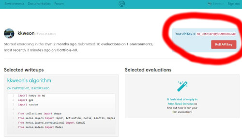

# Reinforcement Zero to All

This is work in progress and it may have bugs.
However, we call for your comments and pull requests. 

We emphasize on the following:

* **Readiability** over anything else
    - That's why we choose Python
* **Pythonic code**
    - PEP8
    - Docstring
* **Use High Level Tensorflow API**
    - Cleaner and easier to understand
* **KISS**
    - [Keep It Simple Stupid](https://www.techopedia.com/definition/20262/keep-it-simple-stupid-principle-kiss-principle)

## Lecture videos
- [Youtube](https://www.youtube.com/playlist?list=PLlMkM4tgfjnKsCWav-Z2F-MMFRx-2gMGG)
 
## File naming rule

```
99_9_description.py
```
- First two digits indicates a category of algorithms
    - 07: DQN
    - 08: Policy Gradient
    - 09: Random Search Methods
    - 10: Actor Critic
- A second digit indicates an id
- Description shows what the file is about
    

## How to use uploader
It makes the uploading process a little bit simpler

1. Go to https://gym.openai.com/
2. Login with your github account
    * https://gym.openai.com/users/YOUR_GITHUB_ACCOUNT
3. Copy your OpenAI api key from the upper right corner of your profile page  

4. Modify `gym.ini`
5. In console
```bash
#python gym_uploader.py /path/to/gym_results
python gym_uploader.py gym-results/
```

## Install requirements
```bash
pip install -r requirements.txt
```

## Run test and autopep8
TODO: Need to add more test cases

```bash
pytest
```

```bash
# pip install autopep8 # if you haven't install
autopep8 . --recursive --in-place --pep8-passes 2000 --verbose --ignore E501
```

## Contributions/Comments
We always welcome your comments and pull requests.
